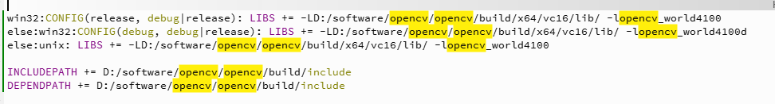

<!--
 * @Author: he jiaxu
 * @Date: 2025-11-16 22:33:06
 * @LastEditTime: 2025-11-17 11:14:42
 * @FilePath: readme.md
 * @Description: 
-->

# 一、SWIRVision配套 QT工程

可显示灰度和事件图像，拥有基本的图像处理功能，如非均匀校正，盲元检测，中值滤波，直方图均衡化
拥有图像处理工具，如数据流保存，图像缩放
串口通信，可控制积分时间，硬件非均匀校正和盲元检测，TEC等指令，读取TEC值，积分值，稳定等参数


# 二、第一次使用gitlab上传操作流程

```C
git init
git add .
git commit -m "first commit"
git remote add originlab http://122.205.5.3:19131/D508/2025_SWIR400W.git
git push -u origin master
```
如果出现以下错误：

`remote: Failed to authenticate user
fatal: Authentication failed for 'http://122.205.5.3:19131/D508/2025_SWIR400W.git/'
`

说明没有权限，需要先在gitlab上创建一个用户，然后使用gitlab的账号密码登录，然后进行push操作。
执行

`git ls-remote originlab`

然后点击这句代码，跳转到登录界面
之后
`git push -u originlab master
`

# 三、注意事项

每次下载工程到新电脑，需要重新修改.pro文件中的路径，否则无法找到相关文件
使用MSVC2019/MSVC2022编译器编译，修改对应的路径
下载opencv并配置环境，修改对应的路径


vscode 修改markdown图片存放路径方法：
https://www.cnblogs.com/xbotter/p/17528063.html

安装完opencv,添加环境变量，修改.pro路径后，仍然出现以下错误：
**成功解决 由于找不到opencv_world410d.dll,无法执行代码，重新安装程序可能会解决此问题**
解决方法：
https://blog.csdn.net/Feeryman_Lee/article/details/106114718
